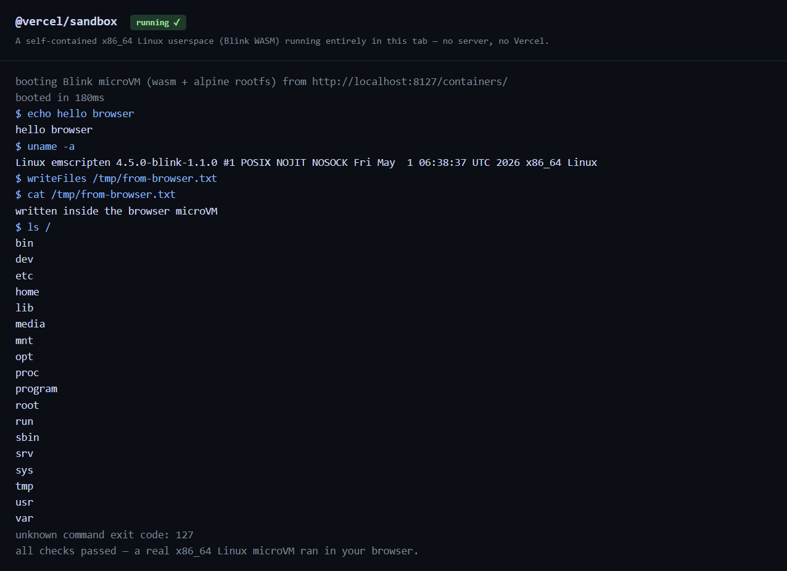

# @anentrypoint/sandbox

Run a real x86_64 Linux userspace **entirely in the browser (or Node)** — no
server, no network, no credentials. Commands execute as real x86_64 ELF binaries
inside a WASM module via [webix](https://github.com/AnEntrypoint/webix), a
Blink-backed emulator that owns the CPU, MMU, ~150 Linux syscalls, and an
in-memory filesystem.

The API mirrors the `Sandbox` surface familiar from `@vercel/sandbox` (which
this is derived from — see `NOTICE.md`), but the backend is fully self-contained.

**[▶ Live demo](https://anentrypoint.github.io/sandbox/)** — boots a Linux
microVM in your browser tab and runs commands live.



## Install

```sh
npm install @anentrypoint/sandbox
```

## Quick start

```ts
import { Sandbox } from "@anentrypoint/sandbox";

const sandbox = await Sandbox.create();

const echo = await sandbox.runCommand("echo", ["hello", "sandbox"]);
console.log(await echo.stdout()); // "hello sandbox"

await sandbox.writeFiles([{ path: "/tmp/note.txt", content: "hi\n" }]);
const note = await sandbox.readFileToBuffer({ path: "/tmp/note.txt" });
console.log(new TextDecoder().decode(note!)); // "hi"
```

Commands run as real x86_64 ELF binaries. The default rootfs is Alpine, so the
full BusyBox applet set (`sh`, `ls`, `cat`, `echo`, `uname`, `expr`, …) is
available out of the box; install more with `apk`. Filesystem writes, snapshots,
and command state persist for the lifetime of the sandbox (one in-browser VM).

## Assets

The Blink WASM and the rootfs tarball are fetched at boot and cached (Cache API
in the browser). Point at your own copies or supply bytes directly:

```ts
await Sandbox.create({
  wasmUrl: "/assets/blinkenlib.wasm",      // default: /containers/blinkenlib.wasm
  glueUrl: "/assets/blinkenlib.js",        // default: /containers/blinkenlib.js
  rootfsUrl: "/assets/alpine-rootfs.tar.gz", // gzip auto-detected
  // or, instead of rootfsUrl:
  // rootfsTarBytes: myUint8Array,
});
```

In the browser, serve `blinkenlib.wasm` with `Content-Type: application/wasm`.
In Node, pass `wasmPath` / `gluePath` filesystem paths.

## Snapshots

`sandbox.snapshot()` captures byte-exact WASM memory + registers. Keep the
returned `Snapshot`; restore is handled by the live host.

## What is not available

Because the Blink build is `NOSOCK` (no TCP/UDP — `socket(AF_INET)` returns
`ENOSYS`) and single-threaded, and because there is no remote account registry,
the following throw `NotSupportedError`:

- **Networking**: `sandbox.domain(port)`, exposed `ports`, dev servers,
  `updateNetworkPolicy`.
- **Remote registry**: `Sandbox.get`, `Sandbox.getOrCreate`, `Sandbox.fork`,
  `Sandbox.list`, `Snapshot.get` / `Snapshot.list` / `Snapshot.tree`. A
  sandbox exists only within the page/process that created it.
- **Sources**: `create({ source: { type: "git" | "tarball" | "snapshot" } })`.
  Seed files with `writeFiles()` instead.

Other build-flag limits inherited from Blink: AVX/AVX-512 raise `SIGILL`
(SSE2 only); `pthread_create` is unavailable (single-threaded).

## Browser support

`CompressionStream`/`DecompressionStream` are used to inflate a gzipped rootfs:
Chrome 80+, Firefox 113+, Safari 16.4+.

## Run the demo locally

```sh
npm install
npm run build
npm run build:demo
node browser-demo/serve.mjs   # http://localhost:8127
```

## License

Apache-2.0 — derived from `@vercel/sandbox` (Apache-2.0), with the remote
backend replaced by the in-browser webix/Blink emulator. See `LICENSE` and
`NOTICE.md`. webix is MIT; Blink (`blinkenlib.wasm`) is ISC.
